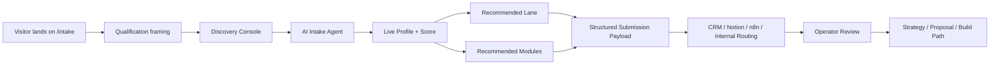
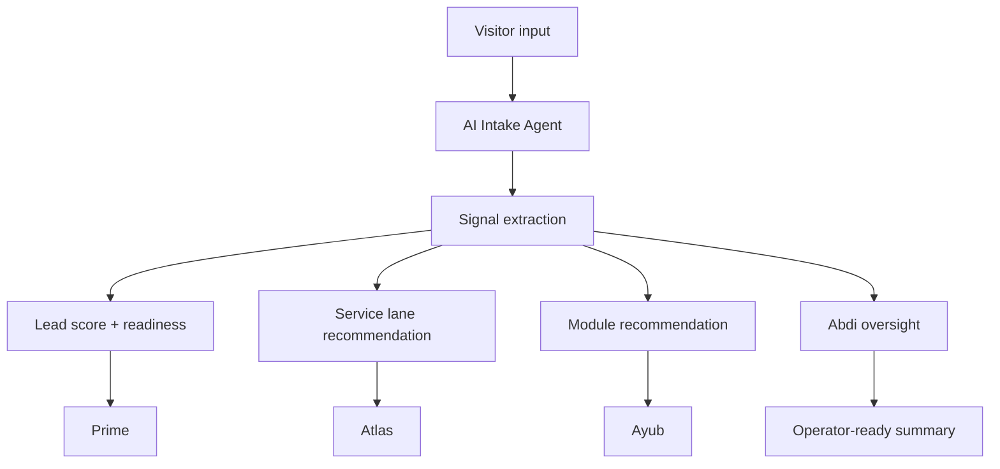

# Task Enterprise Intake System | HQ

> This is the front-end qualification engine, system-mapping layer, and agent-routed intake surface for Task Enterprise LLC. It is not a contact form. It is a live diagnosis system designed to turn attention into qualified client opportunities.

---

## Core Purpose

- Turn site visitors into qualified leads
- Help people explain their business even when they do not know the exact system they need
- Map the right build path in real time
- Route opportunities into the correct Task Enterprise service lane
- Create structured internal intelligence for CRM, automation, agents, and operator review
- Make the brand feel serious, premium, and high-trust before a call ever happens

---

## What This System Is

The intake page is a **System Intake Console**.

It combines:

- adaptive qualification
- live business diagnosis
- AI-guided discovery
- module recommendation
- lead scoring
- voice and text intake
- structured output for backend routing

This system exists so Task Enterprise can sell **systems**, not generic packages.

---

## Command Standard

> Every intake session should make the user feel understood, guided, and properly scoped. The system should never push a bloated recommendation. It should identify the cleanest, most honest, highest-leverage build for that business at its current stage.

---

## System Snapshot

| Layer | Function | Outcome |
| --- | --- | --- |
| Hero / Pre-frame | Sets qualification tone | Filters weak-fit traffic |
| Discovery Console | Collects business data progressively | Improves clarity and trust |
| AI Intake Agent | Understands business context through chat/voice | Reduces friction and confusion |
| Live Profile Panel | Updates fit score and readiness in real time | Makes the system feel alive |
| Recommendation Engine | Suggests service lane and modules | Builds confidence in the right solution |
| Submission Payload | Structures everything for ops | Clean handoff into CRM, Notion, n8n, and agent routing |

---

## Visual System Map



---

## Intake Flow

### 1. Business Identity

- business name
- contact name
- email
- phone
- website
- industry
- geography
- team size
- revenue band

### 2. Current State

- tool stack
- CRM status
- documentation state
- manual operations
- workflow friction
- scattered systems

### 3. Pain + Priority

- lead leakage
- follow-up inconsistency
- onboarding gaps
- support delay
- reporting blindness
- website problems
- automation gaps
- AI agent opportunities
- internal ops friction

### 4. Goals

- 30-day goal
- 60-day goal
- 90-day goal
- first system to automate
- urgency
- preferred rollout style

### 5. Budget + Readiness

- budget band
- timeline
- decision-maker status
- desired next step

### 6. Final Review

- summary of business situation
- recommended lane
- suggested modules
- estimated complexity
- likely implementation tier
- next action

---

## AI Intake Agent

### Function

The AI intake agent is the discovery layer that helps the visitor talk through:

- what the business does
- what is broken
- what is slowing growth
- what they have already tried
- what they actually need first

### Rules

- discovery first
- no lazy generic sales language
- no random package pushing
- one clear step at a time
- adapt recommendations based on what the user can actually use and afford
- support both text and voice

### Goal

> The agent should reduce confusion and increase buying confidence by helping the visitor understand the exact system Task Enterprise should build.

---

## Service Lanes

| Lane | Use Case |
| --- | --- |
| AI Agent Systems | Lead qualification, support, follow-up, internal knowledge, onboarding |
| Workflow Automation | Repetitive ops, routing, CRM sync, booking, notifications, admin reduction |
| Internal Ops Systems | Dashboards, portals, SOP systems, command layers, operator tools |
| Website + Conversion Systems | Websites, landing pages, trust-building pages, intake flows, conversion layers |
| CRM + Pipeline Systems | Lead stages, contact structure, follow-up discipline, visibility |
| Client Onboarding Systems | Intake, setup, kickoff, handoff, activation |
| Knowledge + Documentation Systems | Internal docs, searchable SOPs, retrieval assistants |
| MCP-Connected Ecosystem | Multi-tool access, agents with tool permissions, integrated business operating systems |

---

## Module Recommendation Engine

The system should assemble modules based on live intake signals.

### Core Modules

- Discovery Module
- Lead Capture Module
- Qualification Module
- CRM Pipeline Module
- Follow-Up Automation
- Appointment Booking
- Onboarding Module
- Support Agent
- Internal Knowledge Agent
- Reporting Dashboard
- Admin Portal
- SOP / Documentation Hub
- Website Conversion Layer
- Payment / Invoice Touchpoints
- Multi-Agent Orchestration
- MCP Tool Access Layer
- Notion / Drive / Calendar / Email Integrations

### Recommendation Logic

| Signal | Recommended Module |
| --- | --- |
| No lead discipline | Lead Capture + Qualification + CRM Pipeline |
| Manual follow-up | Follow-Up Automation |
| Missed appointments | Booking + reminders |
| Messy onboarding | Onboarding Module |
| Repeated support questions | Support Agent + Knowledge Agent |
| Internal confusion | SOP Hub + Admin Portal |
| Scattered reporting | Reporting Dashboard |
| Weak website conversion | Website Conversion Layer |
| Multi-system business | MCP Tool Access Layer + Multi-Agent Orchestration |

---

## Qualification System

The intake system scores the lead live so the operator can see:

- business maturity
- urgency
- clarity of need
- likely implementation readiness
- fit with Task Enterprise services

### Score Bands

| Score | Status |
| --- | --- |
| 0–34 | Early exploration |
| 35–59 | Qualified opportunity |
| 60–79 | Strong fit |
| 80–100 | Priority build candidate |

### Inputs That Raise Score

- clear operational pain
- strong urgency
- existing lead flow
- team or admin strain
- business maturity
- concrete outcome goals
- decision-maker involvement
- budget readiness

---

## Live Profile Panel

The right-side profile panel exists to make the system feel like a real operating console.

It should show:

- Qualification Score
- Business Type
- Team Size
- Revenue Range
- Main Bottleneck
- Primary Goal
- Urgency
- Recommended Lane
- Estimated Build Type
- Suggested Modules

### UI Objective

> The right panel should feel like the business is being diagnosed live by a system, not just filled into a form.

---

## Voice Layer

Voice is a major conversion layer because many visitors come from social and mobile.

### Voice Requirements

- voice-first possible
- transcript visible before send when needed
- fast response
- human-like pacing
- fallback to text when voice is unavailable
- no robotic feeling

### Agent Voice Alignment

| Agent | Voice Direction |
| --- | --- |
| Abdi | East African / Arab male, dominant leader |
| Ahmed | Nigerian male, middle-aged |
| Dame | UK male, demanding, dominant |
| Rex | Australian male, 30s |
| Sygma | Australian female, 30s |
| Ayub | Indian / Arab middle-aged male |
| Atlas | American male, polished |
| Prime | Asian male, polished and controlled |

---

## Agent Ownership

| Agent | Ownership in Intake System |
| --- | --- |
| Abdi | Oversees system alignment, escalation, quality, and execution continuity |
| Ahmed | Organizes structure, documentation, and internal clarity |
| Sygma | Visibility, dashboards, telemetry, and what the operator sees |
| Rex | Infrastructure stability, integrations, and runtime resilience |
| Dame | Systems and machine-side execution discipline |
| Prime | Scoring, commercial logic, value realism, and revenue fit |
| Atlas | Marketing fit, offer mapping, growth lane recommendation |
| Ayub | Build path, technical feasibility, implementation direction |

---

## Multi-Agent Routing Logic



---

## Submission Payload

```json
{
  "contact": {
    "name": "",
    "email": "",
    "phone": "",
    "businessName": "",
    "website": ""
  },
  "business": {
    "industry": "",
    "teamSize": "",
    "revenueRange": "",
    "location": ""
  },
  "currentState": {
    "tools": [],
    "bottlenecks": [],
    "manualProcesses": [],
    "crmStatus": "",
    "documentationStatus": ""
  },
  "goals": {
    "primaryGoal": "",
    "desiredOutcome": "",
    "urgency": "",
    "timeline": ""
  },
  "fit": {
    "qualificationScore": 0,
    "readinessStatus": "",
    "recommendedLane": "",
    "estimatedComplexity": "",
    "budgetBand": ""
  },
  "recommendations": {
    "modules": [],
    "notes": [],
    "nextStep": ""
  },
  "source": {
    "page": "/intake",
    "submittedAt": "",
    "userAgent": ""
  }
}
```

---

## Before vs After

### Before

- visitors are unsure what they need
- website inquiry forms create weak leads
- follow-up is inconsistent
- there is no clear diagnosis step
- internal team gets vague inbound requests
- build scoping starts too late

### After

- visitors explain their business through voice or text
- the system qualifies them live
- Task Enterprise recommends the right lane and modules
- operators receive structured, high-signal intake data
- better-fit prospects move faster toward calls and builds

---

## Visual Reference Blocks

### Intake Command Flow

```text
Visitor
  ↓
Intake Console
  ↓
AI Discovery
  ↓
Fit Score + Lane + Modules
  ↓
Structured Internal Payload
  ↓
Operator Review
  ↓
Proposal / Strategy / Build
```

### Intake UX Principle

> The page should never feel like paperwork. It should feel like a serious system helping a business figure out what to build next.

---

## Current Product Direction

- premium dark command-center UI
- adaptive multi-step discovery
- right-side live profile
- module recommendation logic
- voice + text input
- structured ops handoff
- eventual CRM / Notion / n8n / agent routing integration

---

## What Success Looks Like

- more qualified inbound opportunities
- clearer discovery before calls
- better-fit project scoping
- less wasted sales time
- more trust before a prospect even speaks to a human
- stronger conversion from social traffic to serious client conversations

---

## Operator Note

This page should remain aligned to one rule:

> Task Enterprise does not sell random packages. Task Enterprise builds the right system for the business in front of it.
